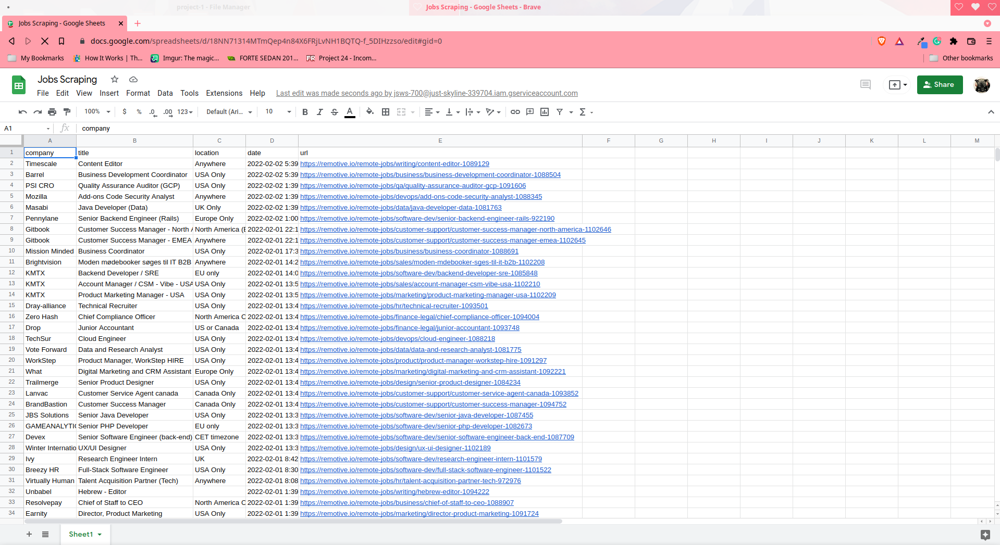

# Node JS Web Scraping

## Project: Job board API

This is little project was created to scrape a job board using their API and save the results in a Google Sheet using the Google Sheet API

### Outcome of this project:

- Call an API from a node script
- Basic web scraping using APIs
- Save and read data from a Google Sheet 
- Use an Excel Sheet as a database

### Preview of the App:

